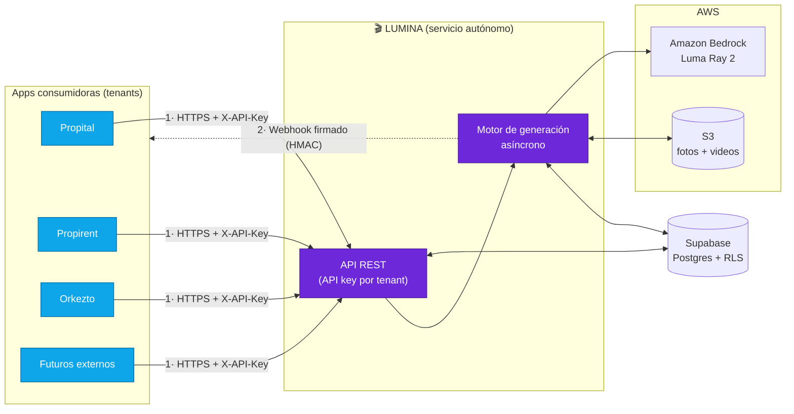
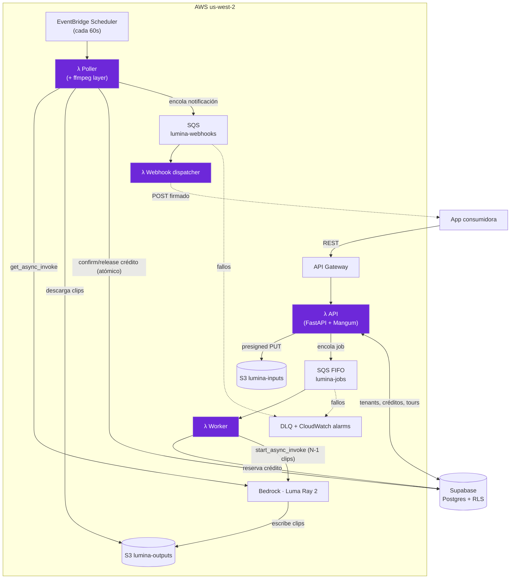
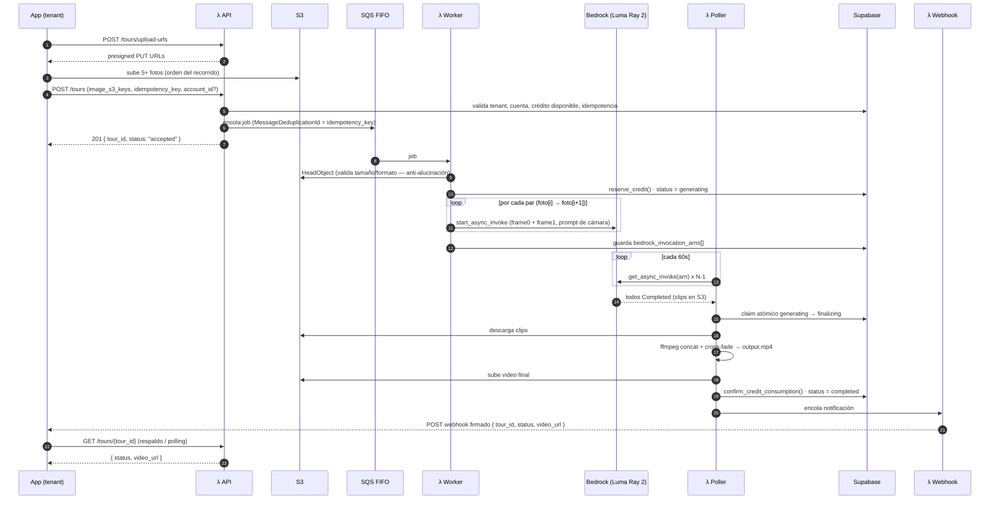
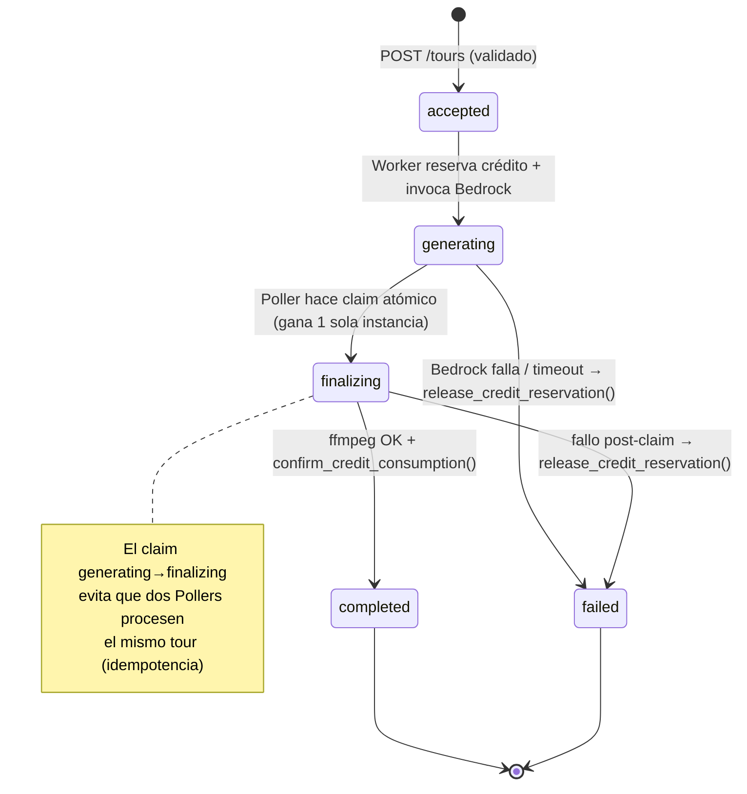
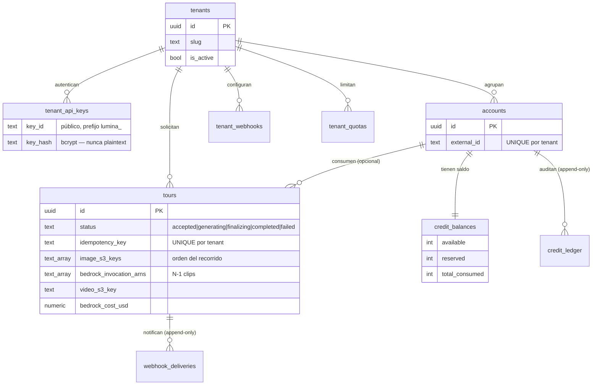
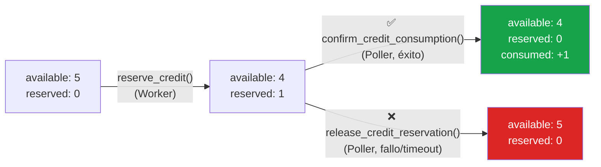
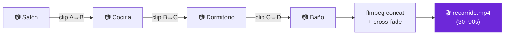
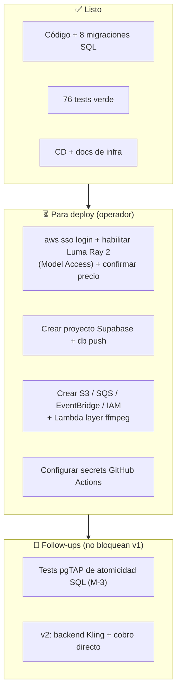
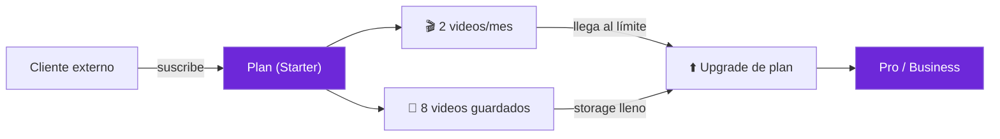

# 🎬 Lumina — Show & Tell

> **Servicio autónomo multi-tenant que convierte fotos de una propiedad en un video tipo "recorrido virtual", usando IA generativa (Amazon Bedrock · Luma Ray 2).**
> Documento de presentación para revisar la arquitectura y **aprobar el deploy**.

---

## 1. TL;DR

Hoy cada app del grupo (Propital, Propirent, Orkezto) tendría que resolver por su cuenta la generación de video, el control de uso y la entrega. **Lumina** lo centraliza en un solo servicio:

- Recibís **≥5 fotos** de una propiedad → te devuelve un **video continuo** (30–90s) donde la cámara "navega" entre ambientes, como si un asesor grabara el recorrido.
- **Asíncrono**: respondés al instante con un `tour_id`, y avisás por **webhook** cuando está listo.
- **Multi-tenant** con **créditos**: cada app controla cuántos tours puede pedir cada cuenta. Un tour fallido **nunca** consume crédito.
- **Serverless puro** sobre AWS, aprovechando **créditos de Bedrock**.

**Estado:** ✅ implementado y testeado (13/13 criterios de aceptación, 76 tests verde, code review aprobado). ⏳ pendiente de deploy a infra real.

---

## 2. Qué resuelve (negocio)

| Antes | Con Lumina |
|---|---|
| Cada app reinventa la generación de video | Un único servicio compartido |
| Sin control central de uso/costo de IA | Créditos + cuotas + auditoría por tenant |
| Riesgo de cobrar y no entregar | Atomicidad crédito↔resultado garantizada |
| Integración acoplada a un modelo | Backend de modelo **pluggable** (hoy Luma, mañana Kling/Veo) |

**Ejemplo Orkezto:** Orkezto vende un tour, le cobra a su cliente, y vía API le **otorga 1 crédito** a la cuenta de ese cliente. Esa cuenta puede generar exactamente 1 tour. También existe el modo **on-demand** (sin cuenta) para integraciones simples.

---

## 3. Diagrama de contexto — comunicación entre apps

**Dos canales de comunicación app ↔ Lumina:**
1. **Request síncrono** (app → Lumina): autenticado con `X-API-Key: <key_id>:<secret>` por tenant.
2. **Notificación asíncrona** (Lumina → app): `POST` al `webhook_url` del tenant, firmado con `X-LUMINA-Signature: sha256=<hmac>` para que la app verifique el origen.

---

## 4. Arquitectura de componentes (serverless)

**4 Lambdas, un solo ZIP, handlers distintos:**

| Lambda | Disparador | Responsabilidad |
|---|---|---|
| **API** (`main.py`) | API Gateway | Auth, validación, créditos (early-check), encola jobs, consulta de estado |
| **Worker** (`worker.py`) | SQS FIFO | Valida imágenes, **reserva** crédito, lanza N-1 invocaciones a Bedrock |
| **Poller** (`poller.py`) | EventBridge 60s | Detecta finalización, **concatena con ffmpeg**, **confirma/libera** crédito, notifica |
| **Webhook** (`webhook.py`) | SQS | Firma HMAC, entrega con reintentos, DLQ |

---

## 5. Flujo de datos end-to-end

> Si Bedrock falla o se vence el `timeout` (25 min), el Poller llama `release_credit_reservation()`: el crédito vuelve a estar disponible y se notifica el fallo. **Nunca** se cobra un tour que no se entregó.

---

## 6. Ciclo de vida de un tour (máquina de estados)

---

## 7. Modelo de datos y multi-tenancy

**Aislamiento (defensa en profundidad):**
- **En código**: cada query/endpoint filtra por `tenant_id`; un tenant nunca ve datos de otro (404/403).
- **En la base**: **RLS** (Row Level Security) habilitado en todas las tablas de negocio — segunda línea de defensa si Supabase se expusiera directamente.
- **Auditoría**: `credit_ledger` y `webhook_deliveries` son **append-only** (solo INSERT/SELECT).

---

## 8. El corazón: créditos atómicos

El mayor riesgo de negocio es **cobrar un crédito por un tour que falla** o **entregar dos veces por un crédito**. Se resuelve con funciones SQL transaccionales + un claim atómico:

- **Atomicidad**: cada función es una transacción `plpgsql` con guardas (`WHERE reserved >= 1`, `WHERE status = 'finalizing'`). Si una segunda ejecución concurrente intenta confirmar, afecta 0 filas → excepción capturada como warning → **sin doble débito**.
- **Idempotencia**: `UNIQUE(tenant_id, idempotency_key)` en la base + `MessageDeduplicationId` en SQS FIFO. Reenviar la misma solicitud devuelve el tour original, no crea otro.
- **On-demand**: si `account_id` es `NULL`, se saltea toda la lógica de crédito (la cuota se controla a nivel tenant).

---

## 9. El modelo de IA — cómo se logra el "recorrido"

**Amazon Bedrock · Luma Ray 2 (`luma.ray-v2:0`, us-west-2)** con **first+last frame conditioning**:

Para N fotos ordenadas, se generan **N-1 clips**: cada uno toma la foto `i` como **frame inicial** y la `i+1` como **frame final**, y el modelo genera la transición de cámara entre ambas. Luego ffmpeg los une con cross-fade → un único video continuo.

**Honestidad técnica (para fijar expectativas):**
- ✅ Da: video continuo, con movimientos de cámara profesionales y coherencia estilística entre ambientes. El **orden de las fotos** define el recorrido.
- ❌ No da: un walkthrough 3D geométricamente exacto (eso requiere NeRF/Gaussian Splatting y 50-200+ fotos, inviable con fotos de marketing).
- 🔄 **Pluggable**: cambiar a Kling/Veo (mejor calidad, fuera de créditos AWS) en v2 es `VIDEO_MODEL_BACKEND=kling` + una clase nueva, **sin tocar** worker, poller ni créditos.

---

## 10. Seguridad

| Vector | Mitigación |
|---|---|
| Autenticación de apps | API key/secret por tenant; el secret se guarda **hasheado con bcrypt** (nunca en claro), verificación **timing-safe** |
| Aislamiento entre tenants | Filtro `tenant_id` en código + **RLS** en Postgres |
| Autenticidad del webhook | Firma **HMAC-SHA256** (`X-LUMINA-Signature`) que la app verifica |
| Entrega de imágenes/video | **Presigned URLs** S3 de vida corta (subida 1h, video 24h); buckets sin acceso público |
| Validación de entrada | Mínimo 5 imágenes + chequeo de formato/tamaño (anti-resultados pobres) antes de gastar IA |
| Secrets de admin | Endpoints `/admin/*` protegidos por `X-Admin-Key` |

---

## 11. Costos y control de gasto

Luma Ray 2 cobra por segundo de video generado:

| Configuración | Clips | Costo Bedrock aprox |
|---|---|---|
| 5 fotos · 9s · 720p | 4 | ~$54 |
| 5 fotos · 5s · 540p | 4 | ~$15 |
| 2 fotos · 5s · 540p (smoke test) | 1 | ~$3.75 |

**Controles desde el día 1:**
- `tenant_quotas` (`max_tours_per_day`, `max_tours_per_month`) por tenant.
- `bedrock_cost_usd` registrado **por tour** → trazabilidad de costo por tenant en CloudWatch.
- Durante la validación, el gasto se cubre con **créditos AWS**.

> Parámetros ajustables por env: `CLIP_DURATION_SECS`, `VIDEO_RESOLUTION`, `MIN/MAX_IMAGES_PER_TOUR`.

---

## 12. API — referencia rápida

| Método | Endpoint | Para qué |
|---|---|---|
| `POST` | `/tours/upload-urls` | Obtener presigned URLs para subir las fotos |
| `POST` | `/tours` | Solicitar un tour (devuelve `tour_id`) |
| `GET` | `/tours/{tour_id}` | Consultar estado / obtener `video_url` |
| `POST` | `/accounts` | Crear o recuperar una cuenta del tenant |
| `POST` | `/accounts/{external_id}/credits` | Asignar créditos a una cuenta |
| `GET` | `/accounts/{external_id}/credits` | Consultar saldo |
| `POST` | `/admin/tenants` | (Admin) provisionar tenant + API key |
| `POST` | `/admin/tenants/{id}/webhooks` | (Admin) configurar webhook |
| `POST` | `/admin/tenants/{id}/quotas` | (Admin) configurar cuotas |
| `GET` | `/health` | Healthcheck |

---

## 13. Garantías de calidad

- ✅ **13/13 criterios de aceptación** cumplidos (auth, validación, atomicidad, idempotencia, aislamiento, notificación, auditoría).
- ✅ **76 tests** en verde (pytest + mocks de AWS/Supabase/ffmpeg).
- ✅ **Code review aprobado**, con verificación empírica de la protección contra regresiones en la lógica de créditos.
- 📋 Pipeline completo documentado en `Propi-doc/imp/lumina/` (requirements → architecture → tasks → implementation → tests → review).

---

## 14. Estado actual y checklist de deploy

**Hecho:** todo el código, SQL (8 migraciones), tests, infra-como-archivos (`docs/aws-infra-setup.md`) y CD (`.github/workflows/cd_lumina.yml`). **Nada desplegado en cloud real todavía** (decisión consciente: validar antes de provisionar).

**Opcional antes del deploy:** smoke test local contra Bedrock real (1 transición, ~$3.75) para ver la calidad del video con una foto-par antes de montar toda la infra.

---

## 15. Visión v2 — Lumina como producto para terceros 💰

Hoy (v1) Lumina es **infraestructura interna**: las apps del grupo otorgan créditos y consumen. Pero el servicio nace **multi-tenant y con billing como punto de extensión limpio**, así que el siguiente salto natural es **Lumina como app/SaaS propia**, vendida a inmobiliarias y proveedores externos.

**Modelo de monetización: planes de suscripción con dos dimensiones medidas.**

| Dimensión | Qué limita | Hoy ya existe como… |
|---|---|---|
| 🎬 **Generación** | cuántos videos podés crear por mes | `tenant_quotas.max_tours_per_month` |
| 💾 **Almacenamiento** | cuántos videos guardás disponibles | retención S3 + contador por cuenta (nuevo en v2) |

Ejemplo de planes (ilustrativo):

| Plan | Videos / mes | Almacenamiento | Precio |
|---|---|---|---|
| **Free** | 1 | 2 videos | $0 |
| **Starter** | **2** | **8 videos** | $$ |
| **Pro** | 10 | 40 videos | $$$ |
| **Business** | a medida | a medida | enterprise |

> La **descarga siempre está permitida** (el video se entrega por link de S3). El negocio se monetiza por **cuánto generás** y **cuánto retenés**: para más videos mensuales o más almacenamiento, **subís de plan**.

**Por qué la arquitectura ya está preparada:**
- El aislamiento multi-tenant, las cuotas y la trazabilidad de costo por tenant **ya existen desde v1**.
- El backend de modelo **pluggable** permite elegir calidad/costo por tier (ej. Luma para Free/Starter, Kling para Pro/Business).
- El billing se diseñó como **punto de extensión**: v1 no cobra dinero; v2 enchufa la pasarela sin reescribir el core.

**Qué agrega v2 (no incluido en v1):**
- Tabla de **planes/suscripciones** y enforcement del límite mensual a nivel plan (no solo tenant).
- **Contador de almacenamiento** por cuenta + lifecycle S3 por plan (en vez de los 30 días fijos).
- Integración de **pago** (Stripe/Fintoc) + portal de autogestión + frontend propio de Lumina.

---

## 16. La decisión de hoy

> **¿Aprobamos avanzar al deploy de v1?**
> El servicio está implementado, testeado y revisado. El siguiente paso requiere habilitar Luma Ray 2, crear el proyecto Supabase y provisionar la infra AWS (todo en `docs/aws-infra-setup.md`). El costo de IA durante la validación se cubre con créditos AWS y está acotado por cuotas por tenant.
